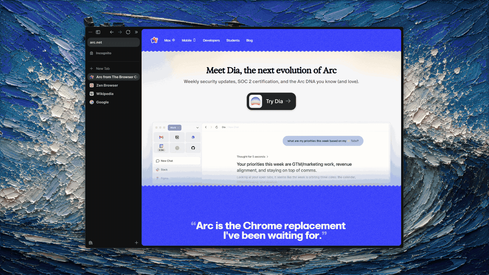

# Little Zen without Sine

A Little Zen backport for Zen Browser on Windows, Linux, and macOS. It uses `userChromeJS` and does not require Sine.

This project is based on [12th-devs/little-zen](https://github.com/12th-devs/little-zen) and includes the behavior and UI changes developed for this setup.



## Features

- Open a blank Little Zen window with `Ctrl+Alt+N`.
- Use an editable address and search bar inside Little Zen.
- Keep searches and typed addresses in the Little Zen window.
- Use Back, Forward, and Reload navigation controls.
- Open a page link in a focused Little Zen window with `Ctrl+Alt+Click`.
- Open an existing Zen tab in Little Zen with `Ctrl+Alt+Click` on the tab.
- Press `Ctrl+O` in Little Zen to move the page to the most recent Space.
- Press `Ctrl+Alt+O` to select a different Space.
- Use the **Open in Space** toolbar control with searchable Space selection.
- Preserve the live tab when moving it back into the main Zen window when possible.
- Adapt the Little Zen frame and toolbar colors to the loaded page.
- Skip this backport automatically when native Little Zen support is available.

## Install

Close Zen, then run one command. The installer includes the required [`fx-autoconfig`](https://github.com/MrOtherGuy/fx-autoconfig) runtime.

### Windows

```powershell
powershell -ExecutionPolicy Bypass -Command "irm https://raw.githubusercontent.com/wahyuabrory/little-zen/main/install.ps1 | iex"
```

If Zen is installed in a protected directory, open PowerShell as Administrator and run the same command. To select paths explicitly:

```powershell
.\install.ps1 -ProfilePath "$env:APPDATA\zen\Profiles\your-profile" -ZenPath "C:\Program Files\Zen Browser"
```

### Linux

```sh
curl -fsSL https://raw.githubusercontent.com/wahyuabrory/little-zen/main/install.sh | sh
```

The installer supports the Zen tarball and normal system packages. A system installation can require `sudo`; the installer prints the exact rerun command if needed.

Zen Flatpak is not supported. Flatpak application files are immutable, but `fx-autoconfig` must add two files beside the browser binary. Use the official tarball instead.

### macOS

```sh
curl -fsSL https://raw.githubusercontent.com/wahyuabrory/little-zen/main/install.sh | sh
```

Writing to `/Applications/Zen.app` can require `sudo`. If required, use the exact rerun command printed by the installer.

### Local or explicit paths

Clone the repository when you need to select paths manually:

```sh
git clone https://github.com/wahyuabrory/little-zen.git
cd little-zen
```

```sh
./install.sh --profile "/path/to/zen/profile" --zen "/path/to/Zen.app"
```

On Linux, `--zen` is the directory containing the `zen` binary. On macOS, it is the `.app` bundle.

The scripts do not delete existing Zen or profile files. They stop if another autoconfig installation would be overwritten. Repeated runs update Little Zen without adding duplicate preferences or CSS imports.

## Manual install

Use this only when `fx-autoconfig` is already installed:

1. Open `about:support` in Zen and open the **Profile Folder**.
2. Close Zen.
3. Copy `littleZen.uc.js` to:

   ```text
   <profile>/chrome/JS/littleZen.uc.js
   ```

4. Copy `little-zen.css` to:

   ```text
   <profile>/chrome/CSS/little-zen.css
   ```

5. Add this line at the top of `<profile>/chrome/userChrome.css`:

   ```css
   @import url("CSS/little-zen.css");
   ```

6. Set `toolkit.legacyUserProfileCustomizations.stylesheets` to `true` in `about:config`.
7. Start Zen.

No Sine files or `sine-mods` configuration are required.

## Use

| Action | Shortcut |
| --- | --- |
| Open blank Little Zen | `Ctrl+Alt+N` |
| Open a link in Little Zen | `Ctrl+Alt+Click` |
| Open a main-window tab in Little Zen | `Ctrl+Alt+Click` on the tab |
| Open in the recent Space | `Ctrl+O` |
| Choose another Space | `Ctrl+Alt+O` |

You can also use the **Open in Space** button in the Little Zen toolbar.

## Debugging

Set `extensions.littleZen.debugRouting` to `true` in `about:config` to write detailed routing messages. Restart Zen after changes to the script or stylesheet.

## Compatibility

Zen internal browser APIs can change between releases. If an update breaks the mod, first test with the latest files and inspect the Browser Console. This backport stops itself when Zen exposes native `ZenLittleWindow` support.

## Credits

- Original project: [12th-devs/little-zen](https://github.com/12th-devs/little-zen)
- `userChromeJS` loader: [MrOtherGuy/fx-autoconfig](https://github.com/MrOtherGuy/fx-autoconfig)
